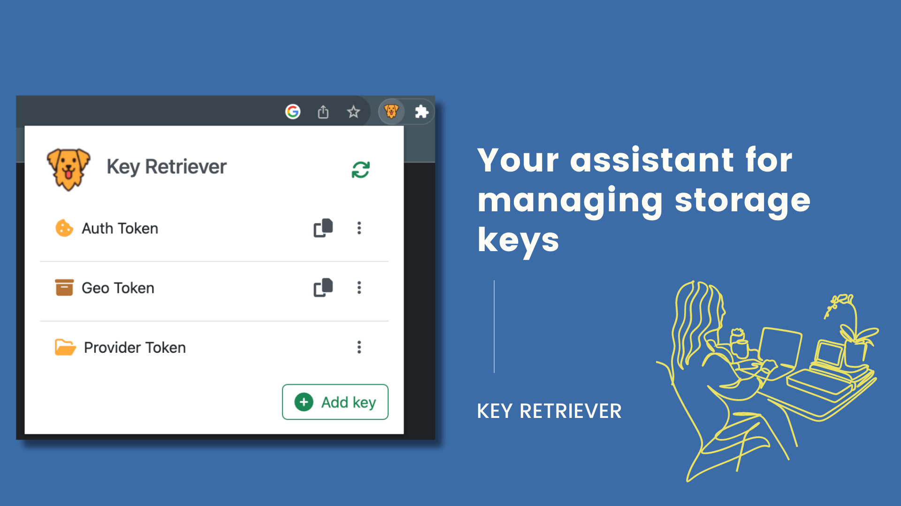

	
	<h1>Key Retriever</h1>
	
🔮 Choose what to watch of your session, local or cookie storage keys/sub keys.

 

# ⚡️ Get it now on: 

For chrome users, while we wait for chrome store approval, check [here](https://github.com/Room-Elephant/extension-chrome-key-retriever/blob/886c21df8ebad621c6f0b28f669825d1b1a83aa9/README.md#installation) how to install the developer version

 

# 🐶 Description
Tired of scavenging daily your dev console for your most used keys? Look no further! With Key Retriever extension, you're just one click away from accessing your most important session, local, or cookie storage keys.

Say goodbye to console struggles! Choose and add your keys to Key Retriever, and watch the magic unfold. Easily view, copy, or modify their values, all without sifting through the dev console chaos.

Oh, and there's more! No more JSON digging for a single key - Key Retriever lets you map those sub keys directly. And for those pesky unreadable names, don't fret! Give them aliases for a clear understanding of what each key represents.

🎨 You can check other promotional material [here](docs/)

 

# 🗃️ Supported storage types

&nbsp;&nbsp;&nbsp;&nbsp; 🗂️ Session storage

&nbsp;&nbsp;&nbsp;&nbsp; 📦 Local storage

&nbsp;&nbsp;&nbsp;&nbsp; 🍪 Cookies - including http only cookies

 

# 🚀 Features

&nbsp;&nbsp;&nbsp;&nbsp; 😎 **List**: Watch your chosen keys of session/local/cookie storage

&nbsp;&nbsp;&nbsp;&nbsp; 🪄 **JSON**: You can even select a sub key inside a JSON value

&nbsp;&nbsp;&nbsp;&nbsp; 💅 **Alias**: Give relevant names to your chosen keys.

&nbsp;&nbsp;&nbsp;&nbsp; ✅ **Copy**: Save the key value directly to your clipboard.

&nbsp;&nbsp;&nbsp;&nbsp; 👀 **View**: Quickly check your key value.

&nbsp;&nbsp;&nbsp;&nbsp; ✏️ **Modify**: Set or update the original value.

 

# ⚙️ Enhancements and issues

For any enhancement or issue you can open a new ticket [here](https://github.com/Room-Elephant/extension-chrome-key-retriever/issues/new).

 

# 🥷 Contributors

 
 
  
    

 

# 🙇 Thanks to

Extension icon by Chanut-is-Industries and you can find it at <a  href="https://www.flaticon.com/free-icons/golden-retriever"  title="golden retriever icons">Golden retriever icons</a> on Flaticon

Empty page image by brgfx and you can find it at <a  href="https://www.freepik.com/free-vector/dog-digging-dirt-white-background_18973243.htm#query=golden%20retriever%20bone&position=26&from_view=search&track=ais">Image by brgfx</a> on Freepik
